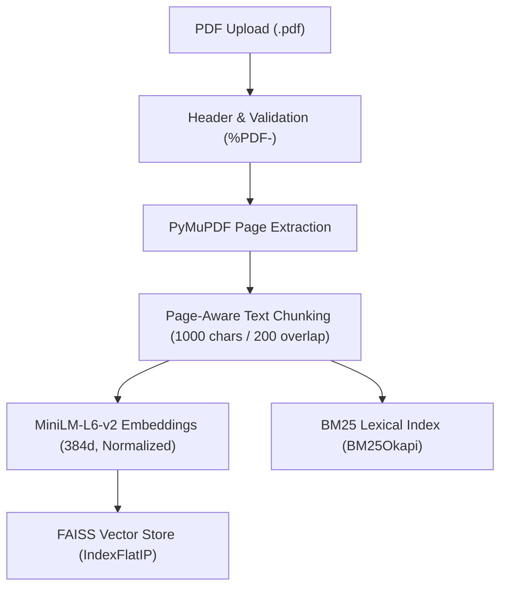
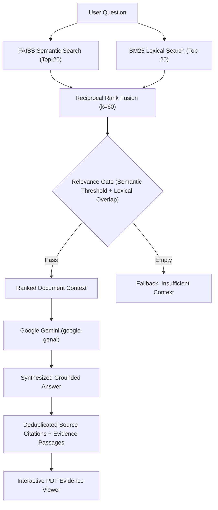

# Lunor — AI Knowledge Assistant

Lunor is a full-stack, document-grounded Retrieval-Augmented Generation (RAG) knowledge assistant. It allows users to upload PDF documents, ask natural language questions, retrieve verifiable evidence through hybrid search, and receive concise, grounded answers accompanied by page citations. Clicking any citation opens an interactive PDF evidence viewer that navigates directly to the cited page and highlights the exact passage supporting the response.

---

## Demo Video

[▶️ Watch the Lunor Demo Video](https://drive.google.com/file/d/139zOeqAkglHyywkYYQyU883QbgVsp1b6/view?usp=sharing)

## 🤖 AI-Assisted Development

Lunor was developed using AI-assisted engineering workflows. AI tools were used for architecture discussions, implementation, technical review, debugging, testing, documentation, and development planning.

| AI Tool | Primary Use |

|---|---|

| **Claude** | Architecture and technical design discussions, RAG and retrieval strategy analysis, independent technical review of major implementation decisions, and debugging/review of core logic. |

| **Antigravity IDE** | Primary AI-assisted coding environment used to implement backend and frontend features, write and update tests, perform codebase audits, run verification commands, and integrate project components. |

| **ChatGPT** | Project planning, implementation guidance, debugging assistance, technical explanations, testing and demo planning, documentation guidance, and development workflow support. |

AI tools were used as development assistants throughout the project. The final implementation was validated through automated tests, manual verification, and codebase audits.

## Features

- **PDF Upload**: Upload PDF files with validation of file extensions and `%PDF-` magic header signatures.
- **Multiple Document Support**: Ingest, index, and query across multiple PDF documents simultaneously.
- **PDF Text Extraction**: Page-by-page text extraction with encrypted/corrupt PDF detection using PyMuPDF.
- **Page-Aware Chunking**: Chunks text strictly within individual page boundaries using `RecursiveCharacterTextSplitter` (1,000 characters, 200 character overlap) to guarantee zero cross-page chunk leakage.
- **Semantic Embeddings**: Dense 384-dimensional vector embeddings generated using `sentence-transformers/all-MiniLM-L6-v2`.
- **FAISS Vector Search**: Fast dense similarity search using FAISS with cosine similarity over L2-normalized embeddings.
- **BM25 Lexical Retrieval**: Exact-match keyword retrieval with `BM25Okapi` to capture technical terms, abbreviations, and identifiers.
- **Reciprocal Rank Fusion (RRF) Hybrid Retrieval**: Fuses semantic and lexical candidate ranks (`k=60`) with score thresholds and content overlap gates.
- **Gemini-Powered Answer Generation**: Grounded generation via Google Gemini (`gemini-2.5-flash` / `gemini-3.8-flash`) with strict anti-hallucination system instructions.
- **Source & Page Citations**: Every grounded answer includes explicit source document names, page numbers, and chunk references.
- **Clickable Citations with Exact PDF-Page Evidence Highlighting**: Clicking any citation opens the exact PDF page rendered as a crisp vector SVG with the evidence passage highlighted in-memory.
- **Conversation History**: Multi-session chat history in the UI with deterministic title generation from the first user question and empty-chat reuse.
- **PDF Deletion**: Complete document removal with automated re-indexing and deletion of vector/BM25 index files when no documents remain.
- **Out-of-Context Handling**: Recognizes when user queries fall outside indexed documents, returns a standard fallback answer, and suppresses unsupported citations.
- **Retrieval & Source Information in the UI**: Inspect citations, evidence passages, and page numbers directly alongside assistant responses.

---

## Architecture

### Ingestion Flow


### Query & Answer Flow


### Backend Component Roles

- **`app/api/documents.py`**: Manages document upload, validation, deletion, SVG page rendering, and PDF file delivery.
- **`app/api/chat.py`**: Coordinates retrieval, generation, error handling, and response schema formatting for user queries.
- **`app/rag/loader.py`**: Performs page-by-page PDF extraction with PyMuPDF and computes stable SHA-256 document identifiers.
- **`app/rag/chunker.py`**: Splits text per page without crossing page boundaries.
- **`app/rag/embeddings.py`**: Provides a lazy CPU singleton of `sentence-transformers/all-MiniLM-L6-v2` with normalized outputs.
- **`app/rag/vector_store.py`**: Manages FAISS building, persistence, and inner-product vector similarity search.
- **`app/rag/bm25_store.py`**: Manages BM25Okapi corpus tokenization, indexing, serialization, and lexical scoring.
- **`app/rag/retriever.py`**: Implements hybrid search combining FAISS and BM25 using Reciprocal Rank Fusion (RRF) and dual relevance gates.
- **`app/rag/generator.py`**: Formats grounded prompts for the Gemini API, configures native HTTP exponential backoff retries, and translates quota errors.
- **`app/rag/evidence.py`**: Extracts concise evidence sentences from chunks and calculates exact bounding boxes on PDF pages with PyMuPDF.

---

## Tech Stack

### Backend
- **Python**: 3.10+
- **FastAPI**: Modern, asynchronous web framework for REST API endpoints
- **PyMuPDF (`fitz`)**: Fast PDF text extraction, vector SVG generation, and text rectangle searching
- **LangChain Text Splitters**: Page-bounded recursive character chunking
- **Sentence-Transformers**: `sentence-transformers/all-MiniLM-L6-v2` dense embeddings
- **FAISS (`faiss-cpu`)**: Dense vector indexing with inner-product similarity
- **Rank-BM25**: BM25Okapi lexical retrieval
- **Google GenAI SDK (`google-genai`)**: Official Google Gemini SDK with native HTTP retry options

### Frontend
- **React**: 18.3 UI library
- **TypeScript**: Strict type safety across all components and API models
- **Vite**: Rapid development server and production bundler
- **Tailwind CSS**: Utility-first styling with responsive layouts

### Testing
- **pytest**: Backend test suite with offline HuggingFace fixtures
- **Vitest**: Fast frontend unit and integration test runner
- **React Testing Library & jsdom**: Accessible component testing
- **HTTPX**: In-process API integration testing via FastAPI `TestClient`

---

## RAG Pipeline

1. **PDF Ingestion**: User uploads a PDF file via `POST /api/documents/upload`. The backend verifies the `.pdf` extension and validates the `%PDF-` file magic signature.
2. **Page-Aware Extraction**: PyMuPDF extracts text page by page, creating a sequence of `PageDocument` records containing `source_filename`, `page_number`, `total_pages`, `text`, and a content-based SHA-256 `doc_id`.
3. **Chunking**: Each page is chunked independently using `RecursiveCharacterTextSplitter` with `chunk_size = 1000` and `chunk_overlap = 200`. Chunks never span across multiple pages.
4. **Embedding Generation**: Chunks are embedded in batches using `sentence-transformers/all-MiniLM-L6-v2` producing 384-dimensional dense vectors with L2 normalization (`normalize_embeddings=True`).
5. **FAISS Indexing**: Embeddings are indexed into a FAISS vector store using `DistanceStrategy.MAX_INNER_PRODUCT`. Because vectors are normalized, inner product strictly equals cosine similarity.
6. **BM25 Lexical Indexing**: Tokenized chunk texts are fitted into a `BM25Okapi` model, enabling keyword and exact term lookup.
7. **Hybrid Retrieval**: For a given user query, the pipeline retrieves the top-20 candidates from FAISS and top-20 candidates from BM25.
8. **Reciprocal Rank Fusion**: Scores from semantic and lexical searches are combined using RRF:
   $$\text{RRF Score}(d) = \sum_{m \in \{\text{semantic}, \text{lexical}\}} \frac{1}{60 + \text{rank}_m(d)}$$
9. **Context Validation**: Retrieved candidates must satisfy either:
   - *Semantic gate*: Cosine similarity $\ge 0.35$ and within $70\%$ of the top semantic score.
   - *Lexical gate*: Lexical rank $\le 3$, non-stopword token overlap, and lexical score $\ge 50\%$ of the top BM25 score.
10. **Gemini Generation**: If no chunks qualify, a standard fallback message is returned immediately without calling the LLM. If chunks qualify, a structured context block is sent to Gemini with instructions forbidding outside knowledge and ungrounded claims.
11. **Citation Generation**: Citations are generated containing `source_filename`, `page_number`, `chunk_id`, and a concise evidence passage extracted from the chunk.

---

## Hybrid Retrieval

Single-retriever pipelines suffer from distinct failure modes:
- **Semantic-only retrieval (dense)** excels at understanding synonyms and conceptual overlap, but can miss exact acronyms, rare technical identifiers, or exact numerical codes.
- **Lexical-only retrieval (BM25)** excels at exact matches, but fails on paraphrased queries or conceptual inquiries.

Lunor combines both approaches:
- **FAISS** captures conceptual relevance even when wording differs.
- **BM25** captures exact technical terms (e.g., `"RRF"`, `"recall@5"`).
- **Reciprocal Rank Fusion (RRF)** standardizes scores across dense similarity metrics and BM25 scores without requiring complex cross-modal calibration.
- **Dual Relevance Gates** filter out spurious matches, ensuring that out-of-domain questions are rejected before reaching the LLM.

---

## Grounded Answers and Citations

- Answers are strictly synthesized from retrieved document chunks. The system prompt directs Gemini to use only the provided context blocks and to ignore instructions embedded inside the documents.
- Citations are created directly from the metadata of retrieved chunks that passed relevance filtering.
- **Insufficient-Context Protection**: When a query cannot be answered by the uploaded documents, Lunor returns:
  > *"I don't have enough information in the knowledge base to answer that question."*

  In this state, `has_sufficient_context` is set to `false`, and the UI displays a "Limited context" indicator while withholding source citation buttons to prevent misleading references.

---

## PDF Evidence Viewer

When the user clicks any citation:
1. The right-hand PDF Evidence Viewer opens to the cited document and page.
2. The backend endpoint `GET /api/documents/{filename}/page` renders the requested PDF page directly into a high-fidelity vector SVG via PyMuPDF.
3. The backend locates the exact evidence passage on the page using `page.search_for()`, accommodating multi-line line-wrapping.
4. A warm, translucent highlight (`fill_opacity=0.30`) is drawn directly onto the PyMuPDF page in memory before SVG export.
5. The frontend displays the vector SVG, smoothly auto-scrolls to the highlighted passage, and displays the exact passage in an amber evidence card.
6. The viewer provides **Fit Width**, **Fit Page**, zoom controls (50% to 250%), and page navigation buttons.
7. **Non-Destructive**: The original PDF file stored on disk is never modified.

---

## Conversation History

- Maintained entirely in frontend React state during the user's active browser session.
- Users can create new sessions using the **+ New Chat** button in the sidebar or switch between active chats.
- Chat session titles are automatically generated from the user's first question using deterministic normalization and truncation (up to 50 characters).
- Switching conversations is instantaneous: it swaps local state without triggering backend API calls or re-indexing.
- In-flight requests are bound to their originating conversation ID, preventing cross-session race conditions.
- Clicking **+ New Chat** reuses an already empty session rather than generating redundant blank chats.
- *Note*: Conversation history is stored in-memory in client state and resets upon browser page refresh.

---

## API Endpoints

| Method | Endpoint | Description |
|---|---|---|
| `GET` | `/api/health` | Returns health status (`{"status": "ok"}`). |
| `GET` | `/api/documents` | Lists all uploaded PDF files stored in `data/uploads`. |
| `POST` | `/api/documents/upload` | Validates, stores, chunks, and indexes an uploaded PDF file. |
| `DELETE` | `/api/documents/{filename}` | Deletes a PDF file and rebuilds or cleans up search indices. |
| `GET` | `/api/documents/{filename}/file` | Serves the raw or in-memory annotated PDF file. |
| `GET` | `/api/documents/{filename}/page` | Renders a page as crisp vector SVG with evidence highlights. |
| `POST` | `/api/chat` | Executes hybrid retrieval and generates a grounded response. |

---

## Project Structure

```text
lunor/
├── .env.example
├── .gitignore
├── README.md
├── backend/
│   ├── .env.example
│   ├── requirements.txt
│   ├── app/
│   │   ├── config.py
│   │   ├── main.py
│   │   ├── api/
│   │   │   ├── chat.py
│   │   │   ├── documents.py
│   │   │   └── health.py
│   │   └── rag/
│   │       ├── bm25_store.py
│   │       ├── chunker.py
│   │       ├── embeddings.py
│   │       ├── evidence.py
│   │       ├── generator.py
│   │       ├── loader.py
│   │       ├── retriever.py
│   │       └── vector_store.py
│   ├── scripts/
│   │   ├── test_api.py
│   │   └── test_gemini.py
│   └── tests/
│       ├── test_api.py
│       ├── test_bm25_store.py
│       ├── test_chunker.py
│       ├── test_embeddings.py
│       ├── test_generator.py
│       ├── test_hybrid_retrieval.py
│       ├── test_loader.py
│       ├── test_retriever.py
│       └── test_vector_store.py
└── frontend/
    ├── .env.example
    ├── .gitignore
    ├── index.html
    ├── package.json
    ├── package-lock.json
    ├── vite.config.ts
    └── src/
        ├── App.tsx
        ├── main.tsx
        ├── components/
        │   ├── ChatInput.tsx
        │   ├── ChatMessage.tsx
        │   ├── ChatWindow.tsx
        │   ├── ConnectionBanner.tsx
        │   ├── ConversationList.tsx
        │   ├── DocumentList.tsx
        │   ├── EmptyState.tsx
        │   ├── PdfViewerPanel.tsx
        │   ├── Sidebar.tsx
        │   ├── SourceList.tsx
        │   └── UploadButton.tsx
        ├── hooks/
        │   ├── useChat.ts
        │   └── useDocuments.ts
        ├── services/
        │   └── api.ts
        ├── test/
        │   ├── frontend.test.tsx
        │   └── setup.ts
        └── types/
            └── api.ts
```

---

## Setup

### Prerequisites
- **Python**: 3.10+
- **Node.js**: 18+
- **Gemini API Key**: A valid Google Gemini API key

### 1. Backend Setup

```bash
cd backend

# Create and activate virtual environment
python -m venv .venv
source .venv/bin/activate  # On Windows: .venv\Scripts\activate

# Install exact pinned dependencies
pip install -r requirements.txt

# Configure environment variables
cp .env.example .env
```

Edit `backend/.env` and supply your Gemini API key:
```env
GEMINI_API_KEY=your-gemini-api-key-here
```

Start the FastAPI server:
```bash
uvicorn app.main:app --reload --port 8000
```

Verify backend health at: [http://127.0.0.1:8000/api/health](http://127.0.0.1:8000/api/health)

### 2. Frontend Setup

In a separate terminal:
```bash
cd frontend

# Install dependencies
npm install

# Optional: configure API URL (defaults to http://localhost:8000)
cp .env.example .env

# Start Vite development server
npm run dev
```

Open the application at: [http://localhost:5173](http://localhost:5173)

---

## Testing

### Backend Test Suite
Run the 117 offline unit and integration tests:
```bash
HF_HUB_OFFLINE=1 TRANSFORMERS_OFFLINE=1 PYTHONPATH=backend backend/.venv/bin/pytest backend/tests -v
```
*(Standard test command: `PYTHONPATH=backend pytest backend/tests -v`)*

**Verified Result**: `117 passed, 0 failed` in ~4.5s.

### Frontend Test Suite
Run the 24 unit and component tests:
```bash
cd frontend
npm test
```

**Verified Result**: `24 passed, 0 failed` in ~800ms.

### Frontend Production Build
Verify TypeScript type checks and Vite bundling:
```bash
cd frontend
npm run build
```

**Verified Result**: Clean production build in ~500ms.

---

## Security & Reliability

- **Path Traversal Protection**: All document access and deletion endpoints sanitize filenames using `Path(raw_name).name`, reject directory separators (`/`, `\`), and verify that resolved paths stay strictly within `data/uploads/`.
- **PDF Signature Validation**: Uploads require both a `.pdf` file extension and validation of the `%PDF-` magic byte header.
- **Untrusted Document Context**: Gemini system prompt explicitly commands the model to treat document context as reference data and disregard instructions embedded in PDFs.
- **Safe Vector Loading**: Deserialization of vector and BM25 store files is strictly confined to the application's local `data/vectorstore` directory.
- **Non-Destructive PDF Rendering**: PDF evidence highlighting is performed on temporary in-memory objects; files on disk are never altered.
- **Graceful Quota Handling**: Intercepts HTTP 429 quota exhaustion errors from Gemini and presents clear guidance in the UI.
- **Zero Committed Secrets**: `.gitignore` prevents tracking `.env` files, virtual environments, local index files, or uploaded documents.

---

## Limitations

- **In-Memory Sessions**: Conversation history lives in frontend React state and resets on page refresh.
- **PDF-Only Scope**: Ingestion pipeline currently supports PDF documents only.
- **Local Index Storage**: FAISS and BM25 indexes are stored on the local filesystem rather than in a managed cloud vector database.
- **Text-Based PDFs**: Relies on PyMuPDF textual layer extraction; scanned image-only PDFs require pre-OCR processing.
- **Single-User Workspace**: No user accounts or role-based access control.

---

## Future Improvements

- **Persistent Conversations**: Persist chat sessions to SQLite/PostgreSQL across browser reloads.
- **Authentication**: Add multi-tenant user authentication and private workspaces.
- **Cross-Encoder Reranking**: Integrate an optional cross-encoder reranker (e.g., `bge-reranker`) after RRF fusion.
- **Cloud Vector Indexing**: Add support for Qdrant, Pinecone, or pgvector for distributed deployments.
- **OCR Support**: Incorporate OCR fallback (e.g., Tesseract or PyMuPDF OCR) for scanned document PDFs.
- **Evaluation Dashboard**: Automated RAG benchmark dashboard measuring faithfulness, precision, and recall.

---

## Testing & Quality Summary

- **Backend Pytest Suite**: 117 passed (0 failures)
- **Frontend Vitest Suite**: 24 passed (0 failures)
- **Frontend Production Build**: Zero TypeScript errors (`tsc && vite build` clean)
- **Formatting & Whitespace**: `git diff --check` clean (0 errors)
- **Security Audit**: No secrets or generated build artifacts tracked in Git

---

## Demo Flow

For evaluators and interviewers, here is a recommended 6-step walkthrough:

1. **Upload Documents**: Drag and drop or upload one or more research or technical PDFs using the sidebar uploader. Observe page and chunk indexing metrics.
2. **Ask a Direct Factual Question**: Query a specific metric or benchmark (e.g., *"What was the recall@5 achieved by Project Atlas?"*).
3. **Inspect Grounded Answer**: Observe the concise answer generated from the context.
4. **Inspect Source Citations**: Note the citation card displaying the source filename and page number.
5. **View Evidence Highlighting**: Click the citation. The PDF viewer panel opens to the exact page, auto-scrolls to the evidence, renders the crisp vector SVG, and highlights the precise supporting passage.
6. **Switch Conversations**: Click **+ New Chat**, ask a question on a different topic, then switch back to the first chat session to demonstrate session history retention without re-querying the backend.

---

## Why This Project Is Technically Interesting

- **Production-Style Hybrid Retrieval**: Rather than relying purely on vector search, Lunor implements Reciprocal Rank Fusion (RRF) between dense FAISS embeddings and sparse BM25Okapi lexical retrieval, solving the out-of-vocabulary and acronym retrieval gap.
- **Traceable Visual Evidence**: Instead of opaque citations, Lunor bridges the gap between text chunks and the source document by computing exact vector coordinate rectangles via PyMuPDF and rendering in-memory highlighted SVGs directly in the UI.
- **Robustness Against Hallucination**: Guardrails suppress citations when retrieval confidence is insufficient and skip LLM calls entirely on empty context matches.
- **Comprehensive Test Coverage**: 141 automated tests spanning backend unit tests, retriever fusion math, Gemini error handling, PDF extraction edge cases, and accessible React components.

---

## License

This repository does not currently include an open-source license. All rights reserved.
